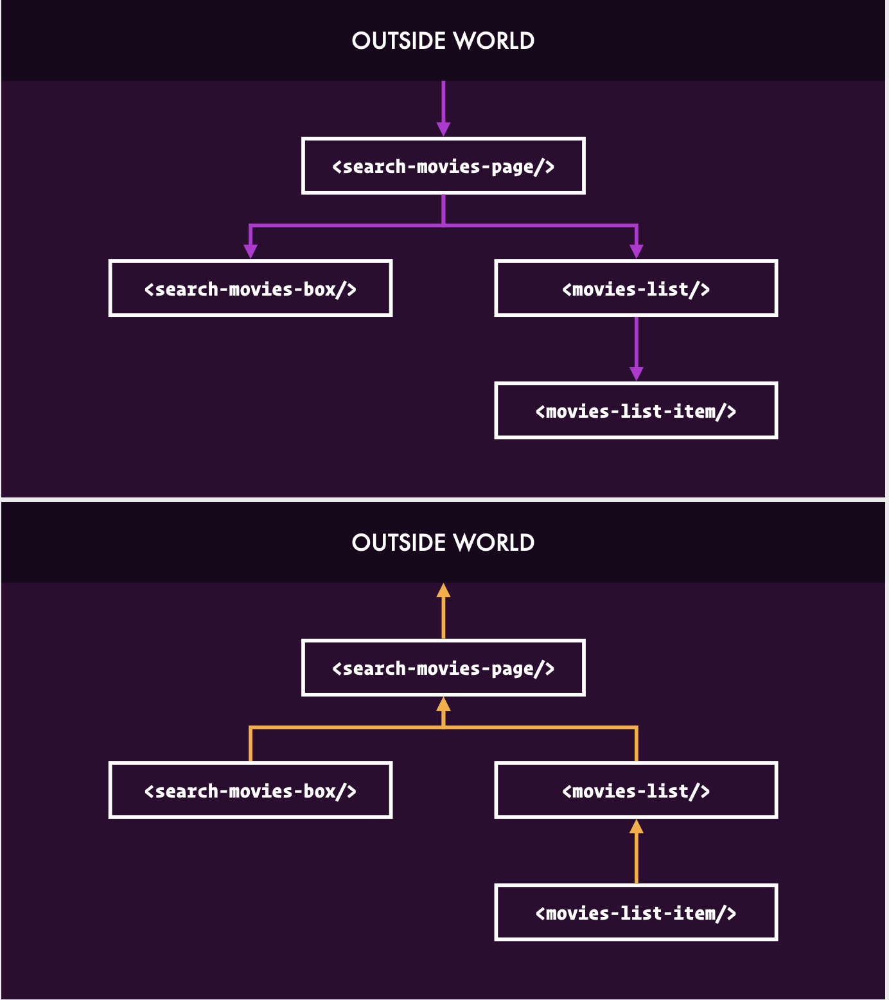
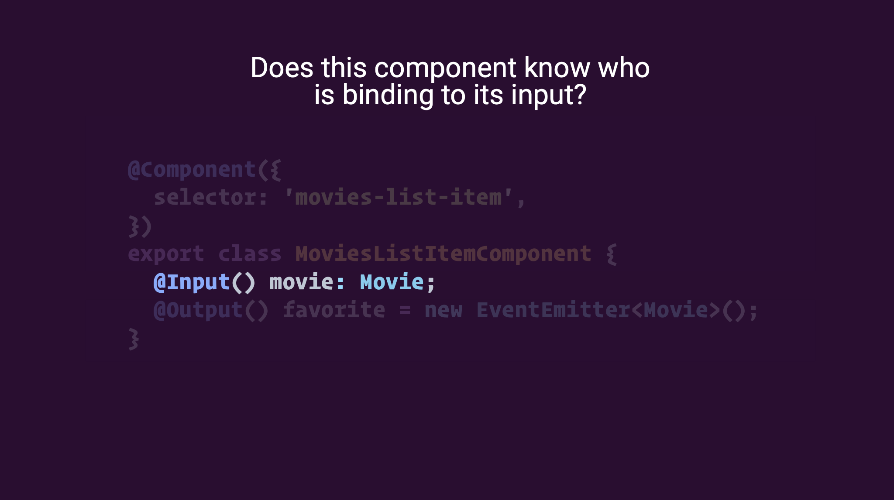
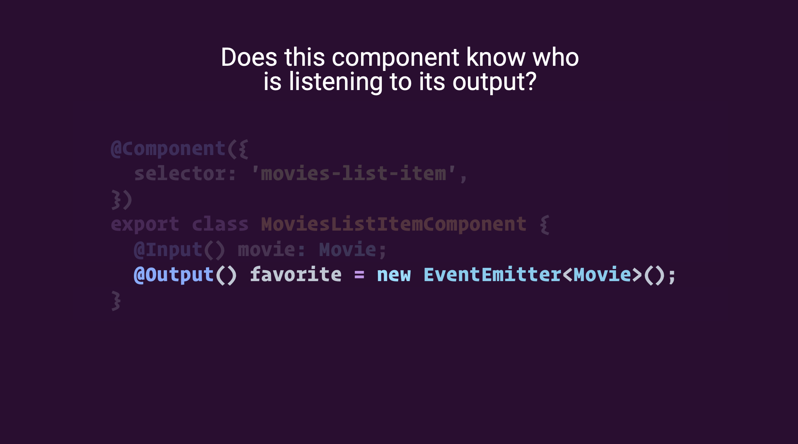

# 00 - Introduction

## The Goal

Understand the architectural implications of NgRx and how to build Angular applications with it

### How does NgRx work?

Well, it's really supposed to work a lot like the components. Components have inputs & outputs. What are the inputs & outputs of NgRx?

### Inputs & Outputs offer Indirection

### Responsibilities

* Containers connect data to components
* Effects trigger side effects
* Reducers handle transitions

