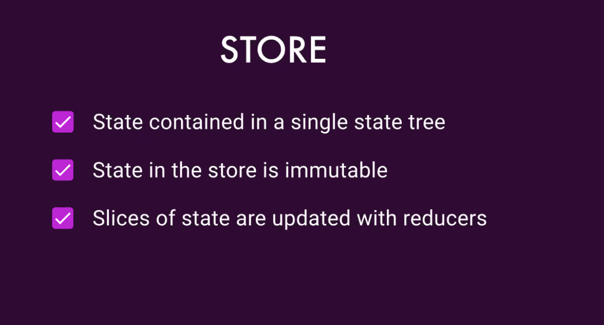

# 02 - Reducers

The following is an example of a piece of State

Then we can define the initial state using the State interface

To create a reducer 

Reducers are in a shared folder because the state is global

To make AOT the reducer needs to be wrappped into a function

The index file declares the state

Modify data in a immutable way

### Recommendations from NgRx Creators

* States and reducers need to go in the shared directory  that can be globally accessed.
* States and reducers need to be in the same reducer file, as the reducer is working directly with the defined state.
  * This was their recommendation, but it wasn't a strong opinion. We should evaluate whether it's preferable to have a separate `.state` file, in the same directory.

