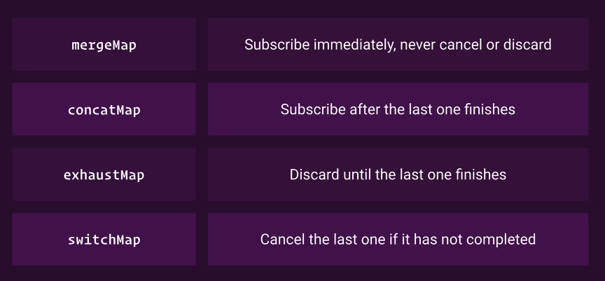
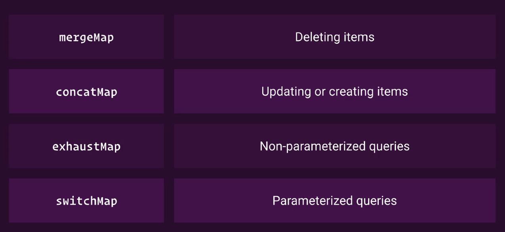

# 04 - Effects

We can move the interaction to the service from the components to the effects

Then register the effects. Note: effects are subscribed immediately

### Tips

* By modularizing the effects \(creating separate effects files for each page\), only the necessary effects are loaded and subscribed when the page is loaded.
* **It is recommended to not use resolvers** since we can dispatch the actions using effects
* An effect **should dispatch a single action,** use a reducer to modify state if multiple props of the state need to be modified
* Prefer the use of brackets and `return` statements in arrow function to increase debugability

### What map operator should I use?

`switchMap` is not always the best solution for all the effects and here are other operators we can use.

_Using the `switchMap` as the default map operator in effects is dangerous._

_Use `concatMap` when the ordering of the operation matters_

### Other examples of using Effects

Effects does not have to start with an action:

Effects can be used to elegantly connect to a WebSocket:

You can use an effect to communicate to any API/Library that returns observables. The following example shows this by communicating with the **snack bar notification API:**

Effects can be used to retry API Calls:

It is OK to write effects that don't dispatch any action like the following example shows how it is used to open a modal

Effects can be used to handle a cancelation

### Good Effects Hygiene

* Let one effect handle one side effect.
  * _"If you are having to dispatch multiple actions from a single effect, that's a code smell. It usually means you probably need to create another set of actions or effects. Try to make diagrams of your control flow and define what your actions and side effects are."_
* _"So in general, an effect dispatching more than 1 action is not advisable. There could be edge cases, but it means perhaps your action is not unique enough."_
* _"If different actions are calling the same API call, they can share the same effect."_
* _"Rather than trying to dispatch multiple actions from 1 effect, it is encouraged to create multiple reducers that listens to 1 action dispatched from the effect instead."_

