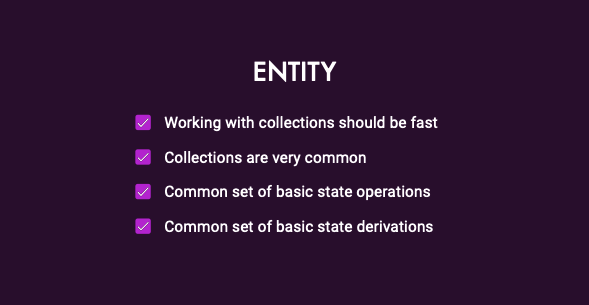

# 05 - Entity



* Common CRUD operations are basically working with collections.
  * Trying to update many items in the collections at the same time can be problematic.
* Use Entity to assist performing operations on collections.
  * Using ngrx/entity is performant

### How to add @ngrx/entity


* Start by creating a `state` that extends the `entityState`

```typescript
// From:

// export interface State {
//     collection: BookModel[];
//     activeBookId: string | null;
// }


// To:
export interface State extends EntityState<BookModel> {

    activeBookId: string | null;
}
```

* Create an adapter and define the initial state with it.

**Note** that the `collection` is no longer needed

```typescript
// From:

// export const initialState: State = {
//     collection: [],
//     activeBookId: null
// };

// To:
const adapter = createEntityAdapter<BookModel>();

export const initialState: State = adapter.getInitialState({
    activeBookId: null
});
```

* Out of the box, it uses the 'id' as the id, but we can also specify custom id and comparer.

```typescript
const adapter = createEntityAdapter<BookModel>({
    selectId: (model: BookModel) => model.name,
    sortComparer:(a:BookModel,b:BookModel)=> a.name.localeCompare(b.name)
});
```

* Refactor the reducers to use the entity adapter

```typescript
const createBook = (books: BookModel[], book: BookModel) => [...books, book];
const updateBook = (books: BookModel[], changes: BookModel) =>
  books.map(book => {
    return book.id === changes.id ? Object.assign({}, book, changes) : book;
  });
const deleteBook = (books: BookModel[], bookId: string) =>
   books.filter(book => bookId !== book.id);
    
    // on(BooksApiActions.bookCreated, (state, action) => {
    //     return {
    //         collection: createBook(state.collection, action.book),
    //         activeBookId: null
    //     };
    // }),
    on(BooksApiActions.bookCreated, (state, action) => {
        return adapter.addOne(action.book, {
            ...state,
            activeBookId: null
        })
    }),

    // on(BooksApiActions.bookUpdated, (state, action) => {
    //     return {
    //         collection: updateBook(state.collection, action.book),
    //         activeBookId: null
    //     };
    // }),
    on(BooksApiActions.bookUpdated, (state, action) => {
        return adapter.updateOne(
            {id: action.book.id, changes: action.book},
            {
                ...state,
                activeBookId: null
            })
    }),

    // on(BooksApiActions.bookDeleted, (state, action) => {
    //     return {
    //         ...state,
    //         collection: deleteBook(state.collection, action.bookId)
    //     };
    // })
    on(BooksApiActions.bookDeleted, (state, action) => {
        return adapter.removeOne(action.bookId, state)
    })
```

* Then create selectors using the entity adapter

```typescript
// From:
// export const selectAll = (state: State) => state.collection;
// export const selectActiveBookId = (state: State) => state.activeBookId;
// export const selectActiveBook = createSelector(
//     selectAll,
//     selectActiveBookId,
//     (books, activeBookId) => books.find(book => book.id === activeBookId) || null
// );

// To:
export const {selectAll, selectEntities} = adapter.getSelectors();
export const selectActiveBookId = (state: State) => state.activeBookId;
export const selectActiveBook = createSelector(
  selectEntities,
  selectActiveBookId,
  (booksEntities, activeBookId) => {
    return activeBookId ? booksEntities[activeBookId]! : null;
  }
);
```

