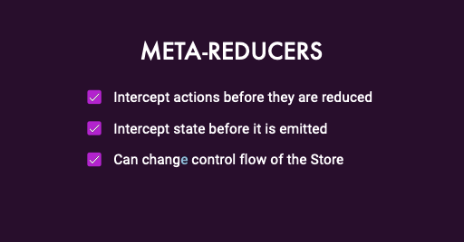

# 06 - Other Tools and Libraries

## Meta-reducers





### 

### Most common use cases:

* Reset state when a signout action occurs
* for debugging creating logger
* to rehydrate when the application starts up

It is like a plugin system for the store, they behave similarly to the **interceptors**

An example of this can be to use it in a logger:

```typescript
const logger = (reducer: ActionReducer<any, any>) => (state: any, action: Action) => {
    console.log('Previous State', state);
    console.log('Action', action);

    const nextState = reducer(state, action);

    console.log('Next State', nextState);
    return nextState;
};

export const metaReducers: MetaReducer<State>[] = [logger];
```

### @ngrx/data

* Goal is to separate what data the client needs from how to retrieve it
* Large apps may not scale so well with app with large set of entities
* NgRx Data is built with NgRx State for full reactivity, and simplifies the code bulkiness
* You don’t need to use NgRx State to make use of NgRx data.

### @ngrx/component

* New in NgRx version 9 with Ivy support!
* @ngrx/components uses observables to detect changes and schedules the change detection
* Instead of "foo$ \| async", use "foo$ \| ngRxPush"
* Instead of "_ngIf=foo$ \| async as foo" use "_ngrxLet=foo$"


