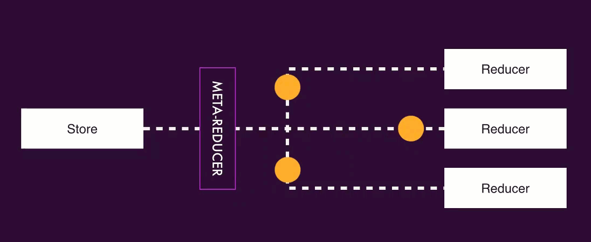

# My notes

## Folder Structure

```typescript
├─ books\
│     actions\
│         books-api.actions.ts
│         books-page.actions.ts
│         index.ts                  // Includes creating names for the exports
│      books.selectors.ts
│     
├─ shared\
│       state\
│          {feature}.reducer.ts     // Includes state interface, initial interface, reducers and local selectors
│          index.ts
│ 
```


## When to use it?

`@ngrx/store` \(or Redux in general\) provides us with a lot of great features and can be used in a lot of use cases. But sometimes this pattern can be an overkill. Implementing it means we get the downside of using Redux \(a lot of extra code and complexity\) without benefiting of the upsides \(predictable state container and unidirectional data flow\).

The NgRx core team has come up with a principle called **SHARI**, that can be used as a rule of thumb on data that needs to be added to the store.

* **Shared**: State that is shared between many components and services
* **Hydrated**: State that needs to be persisted and hydrated across page reloads
* **Available**: State that needs to be available when re-entering routes
* **Retrieved**: State that needs to be retrieved with a side effect, e.g. an HTTP request
* **Impacted**: State that is impacted by other components

Try not to over-engineer your state management layer. Data is often fetched via XHR requests or is being sent over a WebSocket, and therefore is handled on the server side. Always ask yourself **when** and **why** to put some data in a client side store and keep alternatives in mind. For example, use routes to reflect applied filters on a list or use a `BehaviorSubject` in a service if you need to store some simple data, such as settings. Mike Ryan gave a very good talk on this topic: [You might not need NgRx](https://youtu.be/omnwu_etHTY)

#### Resources

* [Reducing the Boilerplate with NgRx](https://www.youtube.com/watch?v=t3jx0EC-Y3c) by Mike Ryan and Brandon Roberts
* [Do we really need @ngrx/store](https://blog.strongbrew.io/do-we-really-need-redux/) by Brecht Billiet
* [Simple State Management with RxJS’s scan operator](https://juristr.com/blog/2018/10/simple-state-management-with-scan/) by Juri Strumpflohner
* [You might not need NgRx](https://www.youtube.com/watch?v=omnwu_etHTY) by Myke Ryan

## Actions

There are a few rules to[ writing good actions](https://ngrx.io/guide/store/actions#writing-actions) within your application.

* **Upfront** - write actions before developing features to understand and gain a shared knowledge of the feature being implemented.
* **Divide** - categorize actions based on the event source.
* **Many** - actions are inexpensive to write, so the more actions you write, the better you express flows in your application.
* **Event-Driven** - capture _events_ **not** _commands_ as you are separating the description of an event and the handling of that event.
* **Descriptive** - provide context that are targeted to a unique event with more detailed information you can use to aid in debugging with the developer tools.

#### Naming Actions

* The **category** of the action is captured within the square brackets `[]`
* It is recommended to use either present or past tense to **describe the event occurred**. 

  * When related to components it makes sense to use present tense because they are related to events. It is like in HTML the events do not use past tense. Eg. `OnClick` or `click` is not `OnClicked` or `clicked`

  ```text
  export const createBook = createAction(
      '[Books Page] Create a book',
      props<{book: BookRequiredProps}>()
  );

  export const selectBook = createAction(
      '[Books Page] Select a book',
      props<{bookId: string}>()
  );
  ```

  * When the action are related to API, it makes sense to use past tense because they are used to describe an action that happened

  ```text
  export const bookUpdated = createAction(
      '[Books API] Book Updated Success',
      props<{book: BookModel}>()
  );

  export const bookDeleted = createAction(
      '[Books API] Book Deleted Success',
      props<{bookId: string}>()
  );
  ```

#### Folders and File structure

It is a good practice to have the actions define close to the feature that uses them.

```typescript
├─ books\
│     actions\
│         books-api.actions.ts
│         books-page.actions.ts
│         index.ts      
```


The index file can be used to define the names for the actions exported, but it can be completely avoided

```typescript
import * as BooksPageActions from "./books-page.actions";
import * as BooksApiActions from "./books-api.actions";

export { BooksPageActions, BooksApiActions };
```


Actions can be created with `props` or fat arrows

```typescript
// With props
export const updateBook = createAction(
    '[Books Page] Update a book',
    props<{
        book: BookRequiredProps,
        bookId: string
    }>()
);

// With fat arrow
export const getAuthStatusSuccess = createAction(
    "[Auth/API] Get Auth Status Success",
    (user: UserModel | null) => ({user})
);
```

## Reducers

* Separate reducer per feature
* Should live outside the feature, because the state it is shared in the whole application
* State should save the model as it comes from the API. This can be later transformed on the selectors.
* Combine actions that can use the same reducer

```typescript
  on(BooksPageActions.enter, BooksPageActions.clearSelectedBook, (state, action) => ({
          ...state,
          activeBookId: null
   })),
```

* Only reducers can modify state and it should do it in an immutable way
* The index file in the reducers declares the state for the whole application

```typescript
import * as fromBooks from "./books.reducer";

export interface State {
    books: fromBooks.State;
}

export const reducers: ActionReducerMap<State> = {
    books:fromBooks.reducer
};

export const metaReducers: MetaReducer<State>[] = [];

```

* Feature reducer file
  * Declares a `State` interface with the state for the feature
  * Declares an `initialState` that included the initial state
  * Declare a feature reducer that contains the result of using `createReducer`
  * Exports a `reducer` function that wraps the reducer created. This is needed for AOT and it is not needed when using Ivy.

```typescript
export interface State {
    collection: BookModel[];
    activeBookId: string | null;
}

export const initialState: State = {
    collection: [],
    activeBookId: null
};

export const booksReducer = createReducer(
    initialState,
    on(BooksPageActions.enter,
        BooksPageActions.clearSelectedBook, (state, action) => ({
        ...state,
        activeBookId: null
    })),
    on(BooksPageActions.selectBook, (state, action) => ({
        ...state,
        activeBookId: action.bookId
    })),
);

export function reducer(state: State | undefined, action: Action) {
    return booksReducer(state, action);
}

```

* The index file defines the state and assigns each reducer to a property on the state

```typescript
export interface State {
    books: fromBooks.State;
}

export const reducers: ActionReducerMap<State> = {
    books:fromBooks.reducer
};

export const metaReducers: MetaReducer<State>[] = [];
```

* Create helper functions to handle the data manipulation of collections

```typescript
const createBook = (books: BookModel[], book: BookModel) => [...books, book];
const updateBook = (books: BookModel[], changes: BookModel) =>
    books.map(book => {
        return book.id === changes.id ? Object.assign({}, book, changes) : book;
    });
const deleteBook = (books: BookModel[], bookId: string) =>
    books.filter(book => bookId !== book.id);
    
...

    on(BooksApiActions.bookCreated, (state, action) => {
        return {
            collection: createBook(state.collection, action.book),
            activeBookId: null
        };
    }),
    on(BooksApiActions.bookUpdated, (state, action) => {
        return {
            collection: updateBook(state.collection, action.book),
            activeBookId: null
        };
    }),
    on(BooksApiActions.bookDeleted, (state, action) => {
        return {
            ...state,
            collection: deleteBook(state.collection, action.bookId)
        };
    })
```

## Selectors

* They should be near the state they usually in the reducer file
* They are in charge of **transforming the data** to how the UI uses it. State in store should be clean and easy to serialize and since selector are easy to test this is the best place to transform. Is also makes it easier to hydrate 
* They can trancsform to "ViewModel", there i s nothing wrong about naming the model specific to the UI that they are using
* "Getter" selectors are simple selector that get data from a property on the state

```typescript
export const selectAll = (state: State) => state.collection;
export const selectActiveBookId = (state: State) => state.activeBookId;
```

* Complex selectors combine selectors and this should be created using `createSelector` . The function only gets called if any of the inputs selectors are modified

```typescript
export const selectActiveBook = createSelector(
    selectAll,
    selectActiveBookId,
    (books, activeBookId) =>
        books.find(book => book.id === activeBookId)
);
```

* Selectors can go next to the component where they are used or in the reducer file located in the `state` folder. Local selectors makes it easier to test
* Global selectors are added in the `state/index`

```typescript
export const selectBooksState = (state:State)=> state.books;
export const selectActiveBook = createSelector(
    selectBooksState,
    fromBooks.selectActiveBook
)
```

* When using the selector in the component is recommended to initialize in the constructor. If using the strict mode in TypeScript, the compiler will not be able to know that the selectors where initialized on `ngOnInit`

## Effects

* Try to keep effect close to the reducer and group them in classes as it seems convenient
* For effects, it's okay to split them into separate effects files, one for each API service. But it's not a mandate
* Is still possible to use guards and resolver, just dispatch an action when it is done
* **They dont want to use Resolvers**
* We want to put the `books-api.effects` file in the same level as books.module.ts, so that the bootstrapping is done at this level and effects are loaded and running if and only if the books page is loaded. If we were to put the effects in the shared global states, the effects would be running and listening at all times, which is not the desired behavior.
* An effect should dispatch a single action, use reducer to modify state if multiple props of the state need to be modified
* Prefer the use of brackets and `return` statements in arrow function to increase debugability

```typescript
// Prefer this
getAllBooks$ = createEffect(() => {
    return this.actions$.pipe(
        ofType(BooksPageActions.enter),
        mergeMap((action) => {
            return this.booksService
                .all()
                .pipe(
                    map((books: any) => BooksApiActions.booksLoaded({books}))
                )
        })
    );
})

// Instead of 
 getAllBooks$ = createEffect(() =>
    this.actions$.pipe(
       ofType(BooksPageActions.enter),
       mergeMap((action) =>
           this.booksService
               .all()
               .pipe(
                   map((books: any) => BooksApiActions.booksLoaded({books}))
               ))
    ))

```

#### What map operator should I use?

`switchMap` is not always the best solution for all the effects and here are other operators we can use.

* `mergeMap` Subscribe immediately, never cancel or discard.Can have race conditions. 

This can be used to _**Delete items**_, because it is probable safe in which order they are deleted.

```typescript
deleteBook$ = createEffect(() =>
        this.actions$.pipe(
            ofType(BooksPageActions.deleteBook),
            mergeMap(action =>
                this.booksService
                    .delete(action.bookId)
                    .pipe(
                        map(() => BooksApiActions.bookDeleted({bookId: action.bookId}))
                    )
            )
        )
    );
```

* `concatMap` Subscribe after the last one finishes

This can be used for _**updating or creating items**_, because the order matters.

```typescript
createBook$ = createEffect(() =>
    this.actions$.pipe(
        ofType(BooksPageActions.createBook),
        concatMap(action =>
            this.booksService
                .create(action.book)
                .pipe(map(book => BooksApiActions.bookCreated({book})))
        )
    )
);
```

* `exhaustMap` Discard until the last one finishes. Can have race conditions

This can be used for _**non-parameterized queries**_. It does only one request event if it gets called multiple times. Eg. getting all books.  


```typescript
getAllBooks$ = createEffect(() => {
    return this.actions$.pipe(
        ofType(BooksPageActions.enter),
        exhaustMap((action) => {
            return this.booksService
                .all()
                .pipe(
                    map((books: any) => BooksApiActions.booksLoaded({books}))
                )
        })
    )
})
```

* `switchMap` Cancel the last one if it has not completed. Can have race conditions

This can be used for _**parameterized queries**_

#### Effect examples

* Effects does not have to start with an action


* Effects can be used to elegantly connect to a WebSocket


* You can use effect to communicate to any API that returns observables. The following talks to the snack bar notification


* You can use effects to retry api calls


* You can write effects that doesn't dispatch any action, like the following example shows how it is used to open a modal


* Use effect to do handle cancellation


## Entity

Use entities to facilitate working with collection, gives a good abstraction and helps reduce code


Adapter provides selectors


Updating the reducer with the adapter


Using the selector with the adapter


Start by creating extends the `entityState`

```typescript
// From:

// export interface State {
//     collection: BookModel[];
//     activeBookId: string | null;
// }


// To:
export interface State extends EntityState<BookModel> {

    activeBookId: string | null;
}
```

Create an adapter and define the initial state with it.

```typescript
// From:

// export const initialState: State = {
//     collection: [],
//     activeBookId: null
// };

// To:
const adapter = createEntityAdapter<BookModel>();

export const initialState: State = adapter.getInitialState({
    activeBookId: null
});
```

Out of the box it uses the 'id' as the id, but we can also specify custom id and comparer. E.g.

```typescript
const adapter = createEntityAdapter<BookModel>({
    selectId: (model: BookModel) => model.name,
    sortComparer:(a:BookModel,b:BookModel)=> a.name.localeCompare(b.name)
});
```

Refactor the reducers

```typescript
    // on(BooksApiActions.bookCreated, (state, action) => {
    //     return {
    //         collection: createBook(state.collection, action.book),
    //         activeBookId: null
    //     };
    // }),
    on(BooksApiActions.bookCreated, (state, action) => {
        return adapter.addOne(action.book, {
            ...state,
            activeBookId: null
        })
    }),
    
    // on(BooksApiActions.bookUpdated, (state, action) => {
    //     return {
    //         collection: updateBook(state.collection, action.book),
    //         activeBookId: null
    //     };
    // }),
    on(BooksApiActions.bookUpdated, (state, action) => {
        return adapter.updateOne(
            {id: action.book.id, changes: action.book},
            {
                ...state,
                activeBookId: null
            })
    }),
    
    // on(BooksApiActions.bookDeleted, (state, action) => {
    //     return {
    //         ...state,
    //         collection: deleteBook(state.collection, action.bookId)
    //     };
    // })
    on(BooksApiActions.bookDeleted, (state, action) => {
        return adapter.removeOne(action.bookId, state)
    })
```

To create selectors we can get the selectors from the adapter

```typescript
// From:
// export const selectAll = (state: State) => state.collection;
// export const selectActiveBookId = (state: State) => state.activeBookId;
// export const selectActiveBook = createSelector(
//     selectAll,
//     selectActiveBookId,
//     (books, activeBookId) => books.find(book => book.id === activeBookId) || null
// );

// To:
export const {selectAll, selectEntities} = adapter.getSelectors();
export const selectActiveBookId = (state: State) => state.activeBookId;
```

#### [Adapter Collection Methods](https://ngrx.io/guide/entity/adapter#adapter-collection-methods)

The entity adapter also provides methods for operations against an entity. These methods can change one to many records at a time. Each method returns the newly modified state if changes were made and the same state if no changes were made.

* `addOne`: Add one entity to the collection
* `addMany`: Add multiple entities to the collection
* `addAll`: Replace current collection with provided collection
* `setOne`: Add or Replace one entity in the collection
* `removeOne`: Remove one entity from the collection
* `removeMany`: Remove multiple entities from the collection, by id or by predicate
* `removeAll`: Clear entity collection
* `updateOne`: Update one entity in the collection
* `updateMany`: Update multiple entities in the collection
* `upsertOne`: Add or Update one entity in the collection
* `upsertMany`: Add or Update multiple entities in the collection
* `map`: Update multiple entities in the collection by defining a map function, similar to [Array.map](https://developer.mozilla.org/en-US/docs/Web/JavaScript/Reference/Global_Objects/Array/map)

## Meta-reducers

* Intercept actions before they are reduced
* Intercept state before it  is emitted
* Can change control flow of the Store



Most common use cases:

* Reset state when a signout action occurs
* for debugging \(creating loggger\)
* to rehydrate when application starts up

It is like a plugin system for the store, they behave similar to the interceptors

  
An example of this can be to use it in a logger

```typescript
const logger = (reducer: ActionReducer<any, any>) => (state: any, action: Action) => {
    console.log('Previous State', state);
    console.log('Action', action);

    const nextState = reducer(state, action);

    console.log('Next State', nextState);
    return nextState;
};

export const metaReducers: MetaReducer<State>[] = [logger];
```

## Other Links


* ngrx example application



* How to handle loading and error states



* RxJS Operators



* NgRx Facades



* Avoiding swithcMaprelated bugs




