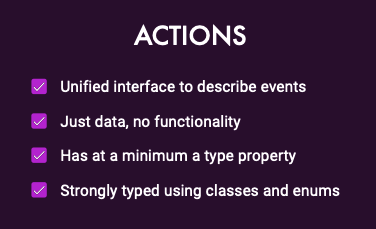

# 01 - Actions

## 

> ### Actions are like the global @output for your whole app



### Good Action Hygiene

* Unique events get unique actions
* Actions are grouped by their source
  * meaning they should be grouped by each page
  * located close to the components dispatching them for traceability of @outputs
* Actions are never reused - Present tense for action names


### Benefits

This makes easier to **debug**, and the specific names makes it **easy to back track.**  
It is easier to refactoring, because of the SRP if multiple components use the same service is harder to abstract.  


### Example

```typescript
export const enter = createAction("[Movies Page] Enter")
```

Metadata can be added to the actions


An action file is made of a collection of actions


Then it can be used in the components


The index file can be used to define the names for the actions exported.

```typescript
import * as BooksPageActions from "./books-page.actions";
import * as BooksApiActions from "./books-api.actions";

export { BooksPageActions, BooksApiActions };
```

## Event Storming


### Example

This is the event storming a a page that creates books


### 

